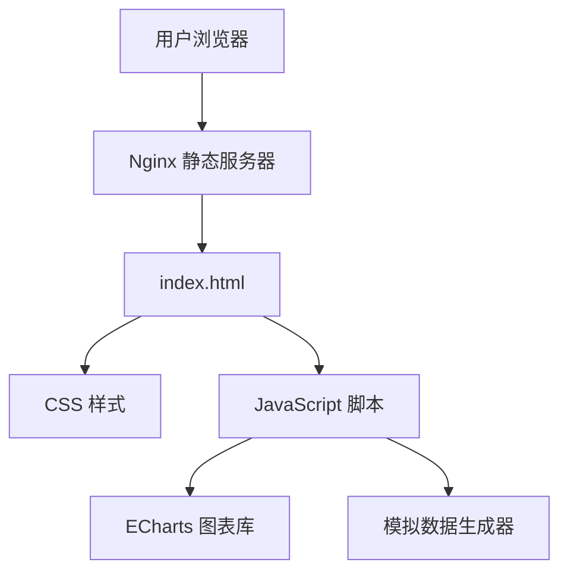
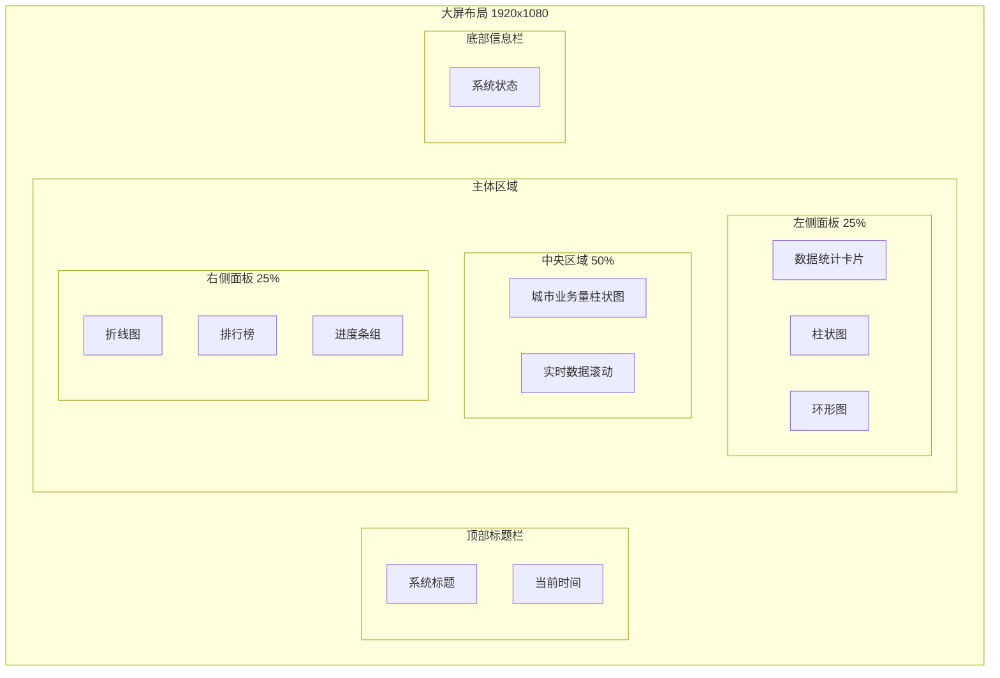

# 数据可视化大屏 - 项目设计文档

## 1. 系统架构



## 2. 页面布局设计



## 3. UI/UX 规范

### 3.1 色彩体系

| 用途     | 色值                 | 说明       |
| -------- | -------------------- | ---------- |
| 主背景色 | #0d1b2a              | 深蓝黑色   |
| 次背景色 | #1b263b              | 深蓝色     |
| 面板背景 | rgba(6, 30, 60, 0.8) | 半透明深蓝 |
| 主色调   | #00d4ff              | 科技蓝     |
| 辅助色1  | #00ff88              | 荧光绿     |
| 辅助色2  | #ff6b6b              | 警告红     |
| 辅助色3  | #ffd93d              | 金黄色     |
| 文字主色 | #ffffff              | 白色       |
| 文字次色 | #8892b0              | 灰蓝色     |

### 3.2 字体规范

- 标题字体: "Microsoft YaHei", "PingFang SC", sans-serif
- 数字字体: "DIN", "Roboto Mono", monospace
- 标题字号: 28px / 24px / 20px / 16px
- 正文字号: 14px / 12px

### 3.3 边框与阴影

- 面板边框: 1px solid rgba(0, 212, 255, 0.3)
- 面板圆角: 8px
- 发光效果: 0 0 20px rgba(0, 212, 255, 0.3)

## 4. 功能模块

### 4.1 顶部标题栏

- 系统名称展示
- 实时时间显示（精确到秒）
- 装饰性边框动画

### 4.2 左侧面板

- **数据统计卡片**: 4个核心指标数字滚动展示
- **柱状图**: 月度数据对比
- **环形图**: 分类占比统计

### 4.3 中央区域

- **核心数据展示**: 平台累计交易总额大数字展示
- **城市业务量柱状图**: 展示各城市业务量，渐变色彩区分城市等级
- **实时数据滚动**: 最新动态信息流

### 4.4 右侧面板

- **折线图**: 趋势分析
- **排行榜**: TOP5 数据排名
- **进度条组**: 完成度指标

## 5. 技术选型

| 类别   | 技术            | 版本  |
| ------ | --------------- | ----- |
| 图表库 | ECharts         | 5.4.3 |
| 样式   | 原生 CSS3       | -     |
| 脚本   | 原生 JavaScript | ES6+  |
| 容器化 | Nginx Alpine    | 1.25  |

## 6. 文件结构

```
frontend/
├── index.html          # 主页面
├── css/
│   └── style.css       # 样式文件
├── js/
│   ├── main.js         # 主逻辑
│   ├── charts.js       # 图表配置
│   └── data.js         # 模拟数据
├── assets/
│   └── fonts/          # 字体文件
├── Dockerfile          # Docker 构建文件
└── nginx.conf          # Nginx 配置
```
